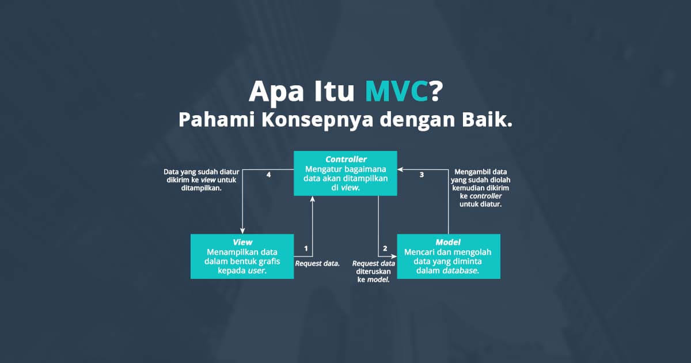

# Laporan Modul 1: Perkenalan Laravel
**Mata Kuliah:** Workshop Web Lanjut   
**Nama:** Muhammad Ridha Rezeki  
**NIM:** 2024573010096
**Kelas:** TI 2B

---

## Abstrak  
Laporan ini memperkenalkan framework Laravel sebagai kerangka kerja PHP modern yang memanfaatkan arsitektur MVC (Model–View–Controller). Laporan membahas pengertian, komponen utama, struktur folder, alur kerja MVC, serta kelebihan dan tantangan yang dihadapi pemula. Tujuan penyusunan laporan adalah memberikan pemahaman awal mengenai dasar-dasar Laravel sebelum mahasiswa melakukan praktik lanjutan dalam pengembangan aplikasi web.

## 1. Pendahuluan

Laravel adalah framework PHP open-source yang membantu developer membangun aplikasi web dengan sintaks yang ekspresif, ringkas, dan elegan. Framework ini menggunakan arsitektur MVC sehingga logika aplikasi, tampilan, dan kontrol dipisahkan dengan jelas.

>Karakteristik utama Laravel:

`Arsitektur MVC`
- Memisahkan Model, View, dan Controller agar kode lebih terstruktur.

`Opinionated `
 - menyediakan banyak fitur siap pakai seperti ORM, templating, migrasi, hingga sistem autentikasi.

`Eloquent ORM `
 - Memudahkan interaksi dengan database melalui sintaks PHP sederhana.

`Blade Templating `
 - Mesin template bawaan untuk membuat tampilan dinamis.

`Autentikasi & Otorisasi `
 - Fitur keamanan pengguna yang sudah terintegrasi.

`Routing Fleksibel `
 - Memetakan URL ke controller/aksi dengan mudah.

Laravel cocok untuk aplikasi CRUD, sistem informasi, e-commerce, hingga REST API.

---

## 2. Komponen Utama Laravel 

 - `Blade (Templating) `
  Mesin template untuk membuat tampilan dinamis.

 - `Eloquent (ORM) `
  Abstraksi database berbasis model yang mempermudah query.

 - `Routing `
  Menghubungkan URL dengan aksi atau controller.

 - `Controllers `
  Menampung logika aplikasi.

 - `Migrations & Seeders `
  Untuk mengelola struktur tabel dan mengisi data awal.

 - `Artisan CLI `
  Command line bawaan untuk membuat file, menjalankan migrasi, dll.

 - `Testing (PHPUnit) `
  Framework pengujian otomatis.

 - `Middleware `
  Filter request/response seperti autentikasi.

---

## 3. Berikan penjelasan untuk setiap folder dan files yang ada didalam struktur sebuah project laravel.

`app`
 - Berisi kode inti aplikasi (controller, model, middleware).

`bootstrap`
 -  Inisialisasi framework dan autoload.

`config`
 - File konfigurasi (database, mail, cache).

`database`
 - File migrasi, seeder, dan factory.

`public`
 - Root folder aplikasi, berisi index.php dan asset publik.

`resources`
 - Blade template, bahasa, dan asset sebelum build.

`routes`
 - Definisi routing (web.php, api.php).

`storage`
 - File log, cache, dan session.

`tests`
 - File pengujian aplikasi.

`vendor`
 - Dependensi hasil instalasi Composer.

`editorconfig`

 - Aturan format kode agar konsisten di semua editor.

`env.example`

 - Template konfigurasi environment (contoh pengaturan database, dsb).

`.gitattributes`

 - Aturan atribut file untuk Git.

`.gitignore`

 - Daftar file/folder yang diabaikan Git (mis. vendor/, node_modules/).

`artisan`

 - File untuk menjalankan perintah Artisan CLI (serve, migrate, dsb).

`composer.json`

 - Daftar dependensi PHP project.

`composer.lock`

 - Versi detail dari dependensi yang sudah diinstall.

`package.json`

 - Daftar dependensi Node.js (frontend, Vite, Tailwind).

`phpunit.xml`

 - Konfigurasi untuk testing dengan PHPUnit.

`README.md`

 - Dokumentasi singkat cara penggunaan project.

`vite.config.js`

 - Konfigurasi untuk Vite (build asset CSS/JS).

`.env`

 - Konfigurasi environment utama (database, app key, mail).

## 4. Diagram MVC dan Cara kerjanya

>Alur Model View Controller

 - Proses pertama adalah view akan meminta data untuk ditampilkan dalam bentuk grafis kepada pengguna.
 - Permintaan tersebut diterima oleh controller dan diteruskan ke model untuk diproses.
 - Model akan mencari dan mengolah data yang diminta di dalam database
 - Setelah data ditemukan dan diolah, model akan mengirimkan data tersebut kepada controller untuk ditampilkan di view.
 - Controller akan mengambil data hasil pengolahan model dan mengaturnya di bagian view untuk ditampilkan kepada pengguna.

## 6. Kelebihan & Kekurangan 
>Kelebihan Laravel:

 - Banyak fitur siap pakai
 - Konsistensi kode antar proyek
 - Memudahkan kolaborasi tim

>Kekurangan:

 - update versi terlalu cepat
 - Ukurannya sangat berat
 - Kurang mudah dipahami
 - Proses intal rumit

---

## 7. Referensi
Muhammad Reza Zulman. Modul 1 – Introduction (Laravel). HackMD.
https://hackmd.io/@mohdrzu/By0Wc1Dule#Modul-1---Introduction

Directory Structure
https://laravel.com/docs/12.x/structure

AcquaintSoft 10 fitur utama laravel
https://acquaintsoft.com/answers/key-features-of-laravel    

Apa Itu Laravel? Fitur, Kelebihan dan KekurangannyaApa Itu Laravel? Fitur, Kelebihan dan Kekurangannya
https://www.jagoanhosting.com/blog/framework-laravel/#kekurangan-laravel

---
