# Laporan Modul 2: Laravel Fundamentasl
**Mata Kuliah:** Workshop Web Lanjut   
**Nama:** Muhammad Ridha Rezeki  
**NIM:** 2024573010096  
**Kelas:** TI 2B  

---

## Abstrak 
Laporan ini membahas penerapan konsep dasar Laravel dalam membangun aplikasi web sederhana. Fokus utama adalah pemahaman struktur MVC, routing, dan penggunaan Blade templating engine. Tujuan dari laporan ini adalah untuk mendokumentasikan proses praktikum, contoh applikasi sederhana kali ini adalah kalkulator.

---

## 1. Dasar Teori
>Apa Itu MVC (Model, View, Controller).

`MVC (Model, View, Controller)`

-  Model bertanggung jawab terhadap data dan interaksi dengan database.
- View menampilkan data kepada pengguna dalam bentuk antarmuka.
- Controller menghubungkan model dan view, serta menangani input dari pengguna.

Struktur ini membantu menjaga keteraturan kode dan memudahkan pengembangan aplikasi berskala besar.

> Konsep Routing di Laravel.

`Routing` 

Routing adalah mekanisme untuk mengarahkan permintaan (request) ke fungsi atau controller tertentu. Laravel menyediakan sistem routing yang fleksibel dan mudah digunakan.

Routing dapat menggunakan metode get, post, put, delete, dan lainnya sesuai kebutuhan aplikasi.

> Fungsi Middleware.

`Middleware`
 
Middleware berfungsi sebagai lapisan pengaman atau filter yang memproses request sebelum mencapai controller.

> Bagaimana cara Laravel menangani Request dan Response.

`Request dan Response`

 Laravel menangani request melalui routing dan mengembalikan response berupa tampilan atau data sesuai logika yang ditentukan.

 > Peran Controller dan View.

`Controller dan View`

Controller bertugas mengelola logika aplikasi, menerima input, dan menentukan output. View bertugas menampilkan data kepada pengguna. Keduanya bekerja sama untuk menghasilkan alur aplikasi yang dinamis dan interaktif.

> Fungsi Blade Templating Engine.

`Blade Templating Engine`

 Blade adalah engine templating Laravel yang memungkinkan penggunaan sintaks PHP dalam file HTML secara efisien dan bersih

---

## 2. Langkah-Langkah Praktikum

2.1 Praktikum 1 – Route, Controller, dan Blade View

- Tambahkan route pada routes/web.php.

Route ini digunakan untuk mengarahkan URL `welcome` ke method show() yang ada di welcomecontroller.

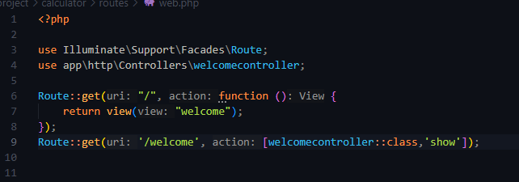

- Buat controller WelcomeController.

Di terminal ketikkan perintah `php artisan make:controller welcomecontroller`, dan isi file seperti berikut

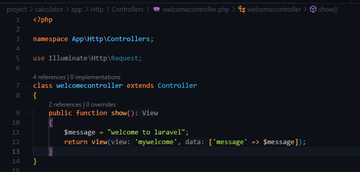

- Buat view mywelcome.blade.php.

View ini berisi tampilan sederhana yang akan ditampilkan ke pengguna saat mengakses halaman welcome.

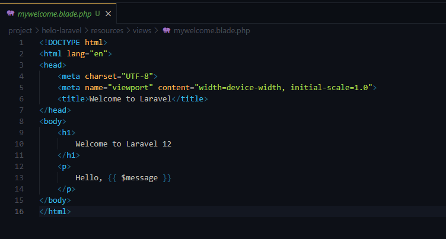

- Jalankan aplikasi dan tunjukkan hasil di browser.

Setelah semua komponen dibuat, jalankan Laravel menggunakan php artisan serve dan membuka URL http://127.0.0.1:8000/welcome untuk melihat hasilnya.

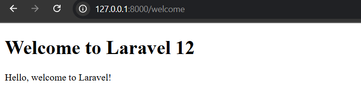

2.2 Praktikum 2 – Membuat Aplikasi Sederhana "Calculator"

- Tambahkan route untuk kalkulator.

line 6 digunakan untuk menampilkan form kalkulator, sedangkan line 7 digunakan untuk memproses input dan menampilkan hasil.

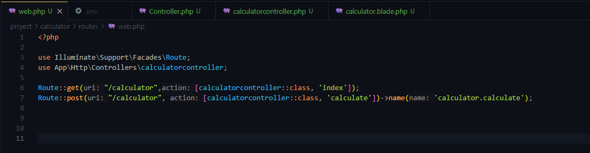

- Buat controller CalculatorController.

Controller ini dibuat menggunakan perintah `php artisan make:controller CalculatorController`. Di dalamnya terdapat method index() untuk menampilkan form dan calculate() untuk memproses inputnya.

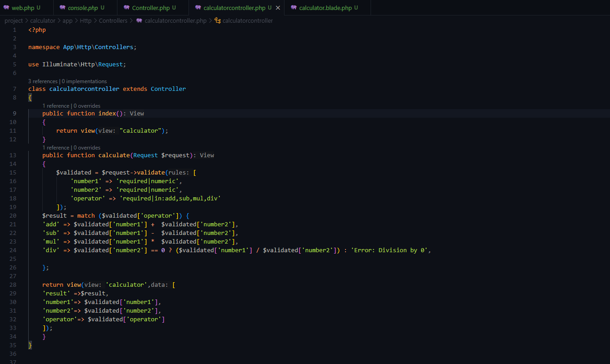

- Tambahkan view calculator.blade.php.

Form kalkulator terdiri dari dua input angka dan pilihan operator. Setelah pengguna mengisi form dan menekan tombol “Hitung”, data dikirim ke controller lewat method calculate.

Sebelum diproses, input akan divalidasi dulu supaya nggak ada kesalahan, misalnya kalau ada angka kosong atau bukan angka. Setelah lolos validasi, controller akan menentukan operasi yang dipilih:
- Kalau pilih add, maka dilakukan penjumlahan.
- Kalau pilih sub, maka dilakukan pengurangan.
- Kalau pilih mul, maka dilakukan perkalian.
- Kalau pilih div, sistem akan cek dulu apakah angka kedua bukan nol. Kalau nol, maka akan muncul pesan error karena pembagian tidak bisa di bagi dengan 0

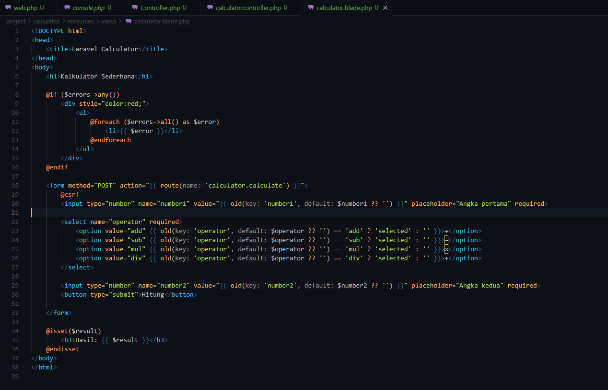

- Jalankan aplikasi dan coba dengan beberapa input berbeda.

`Screenshot Hasil Pertambahan :`

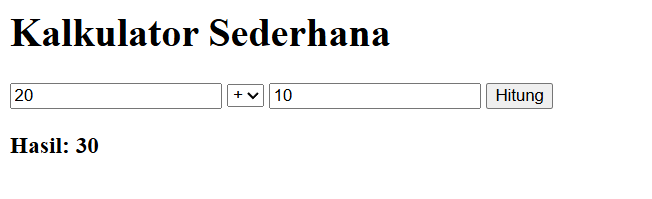

`Screenshot Hasil Pengurangan :`

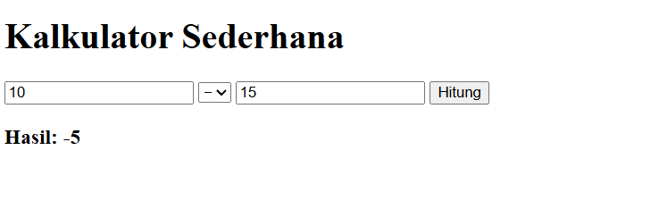

`Screenshot Hasil Perkalian :`

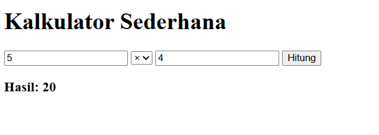

`Screenshot Hasil Pembagian :`
 - Pembagian normal

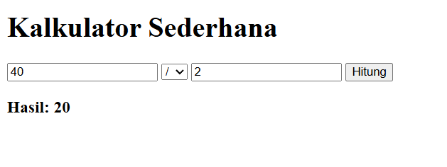

 - Pembagian di bagi 0 = menampilkan eror

 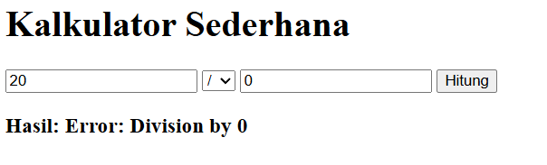

---

## 3. Hasil dan Pembahasan
- Apakah aplikasi berjalan sesuai harapan?

    Aplikasi kalkulator Laravel berhasil dijalankan. Ketika pengguna mengakses halaman `/calculator`, sistem menampilkan form input yang terdiri dari dua angka dan pilihan operator matematika. Setelah data diinputykan, hasil perhitungan langsung ditampilkan di halaman yang sama.

- Apa yang terjadi jika ada input yang salah (misalnya pembagian dengan 0)?

    Pembagian dengan angka nol, sistem akan menampilkan pesan “Error: Division by 0” karena pembagian tidak bisa di bagi 0.

- Bagaimana validasi input bekerja di Laravel?

     Validasi input dilakukan menggunakan method `$request->validate()` . Validasi ini memastikan bahwa semua data yang dikirim melalui form memenuhi syarat yang ditentukan, seperti wajib diisi (required), harus berupa angka (numeric), dan operator harus termasuk dalam daftar yang diizinkan (in:add,sub,mul,div). Jika validasi gagal, Laravel akan mengembalikan halaman dengan pesan error dan input sebelumnya tetap ditampilkan.

- Apa peran masing-masing komponen (Route, Controller, View) dalam program yang dibuat?

`Route` bertugas mengarahkan permintaan pengguna ke controller yang sesuai.

`Controller` menangani logika aplikasi, termasuk validasi dan perhitungan.

`View` menampilkan form input dan hasil perhitungan kepada pengguna.

Ketiga komponen ini saling terhubung dan membentuk alur kerja yang terstruktur, sehingga memudahkan pengembangan dan pemeliharaan aplikasi.

---

## 4. Kesimpulan

Praktikum ini membantu memahami dasar penggunaan Laravel, terutama konsep MVC, routing, dan Blade. Dengan membuat aplikasi kalkulator sederhana, belajar bagaimana Laravel menangani input, validasi, dan menampilkan hasil ke pengguna. 

---

## 5. Referensi

- B1zwKEK5xe” — HackMD oleh Mohd Rzu. https://hackmd.io/@mohdrzu/B1zwKEK5xe     
- Modul Workshop Web Lanjut — Pemrograman Web Lanjut Menggunakan Laravel, Evi Lestari Pratiwi, Politeknik Negeri Banjarmasin.
https://press.poliban.ac.id/uploads/file/Evi_Lestari_Pemrograman_Web_Lanjutan_publish.pdf

---
