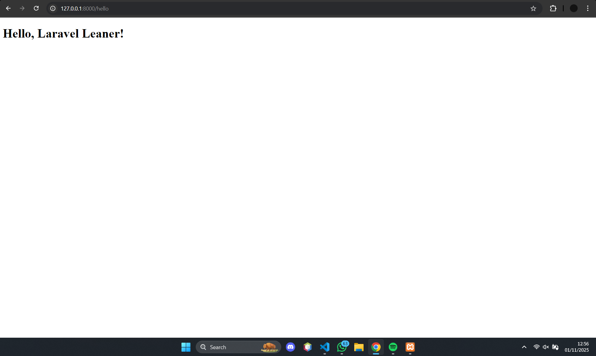
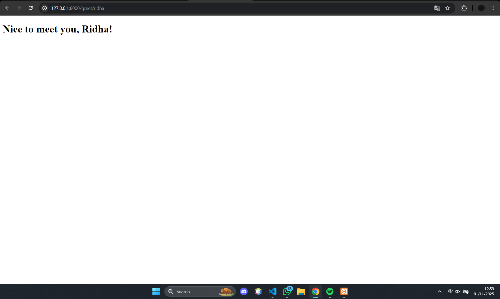
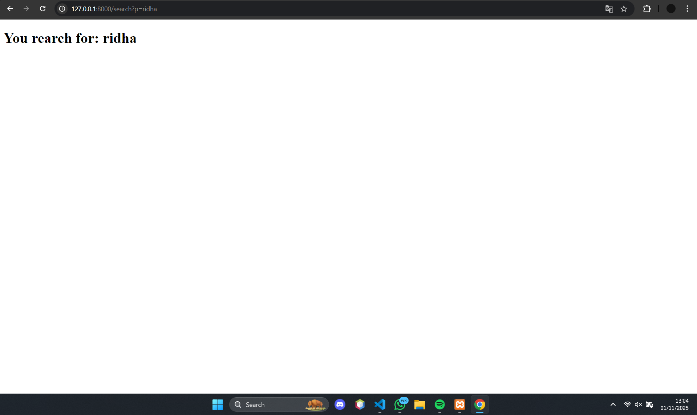
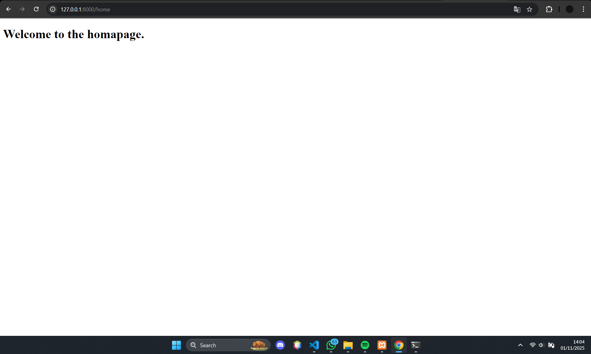
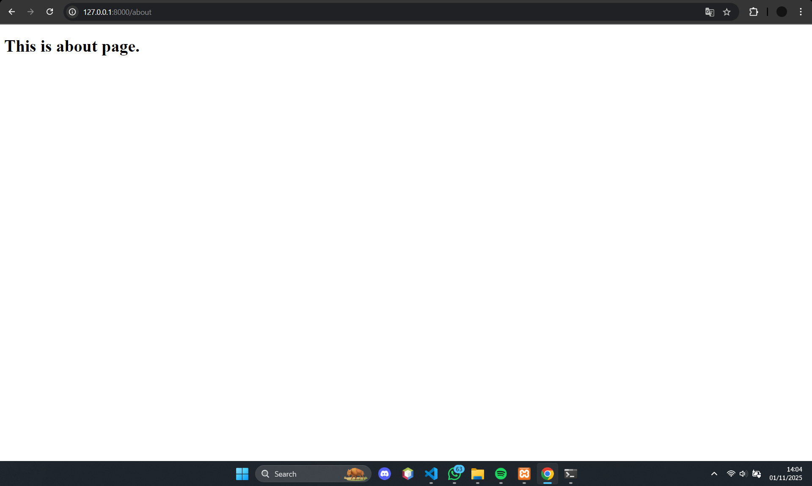
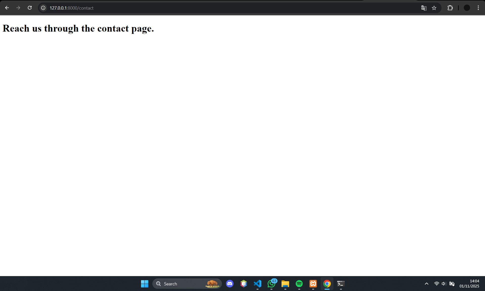
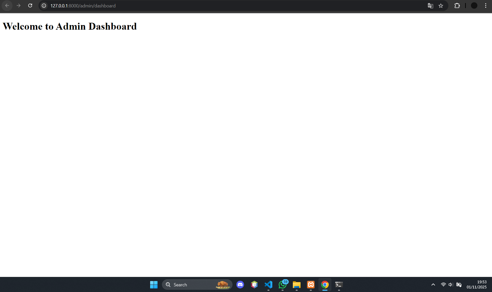
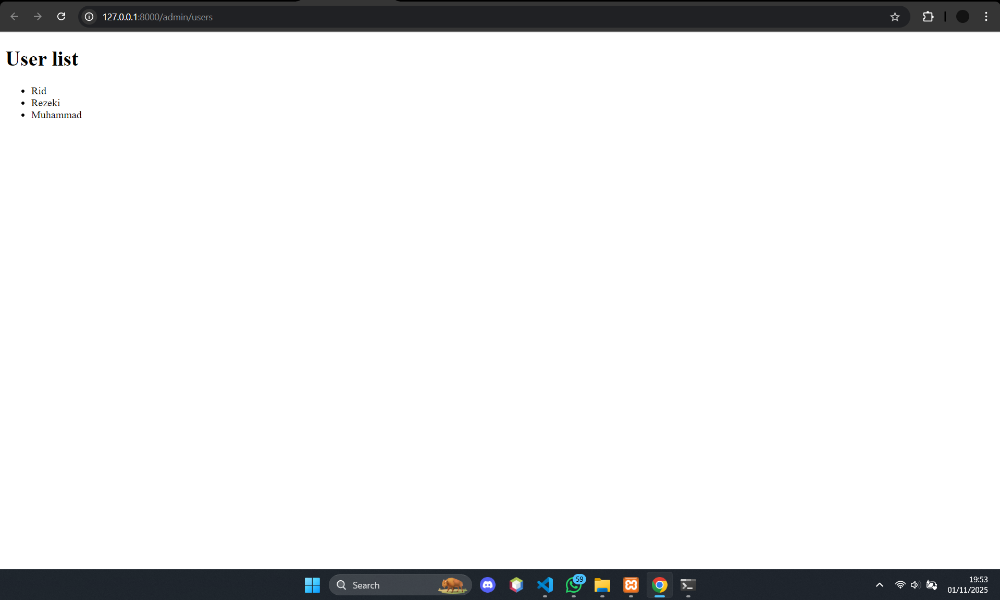
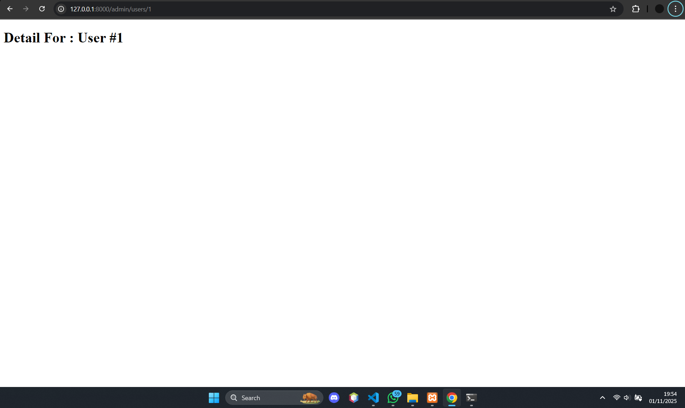

# Laporan Modul 3: Controller Laravel 12

**Mata Kuliah:** Workshop Web Lanjut  
**Nama:** Muhammad Ridha Rezeki  
**NIM:** 2024573010096  
**Kelas:** TI 2B  

---

## Abstrak
Laporan ini membahas penerapan konsep **Controller** dalam framework **Laravel 12**, yang merupakan komponen penting dari pola arsitektur **Model-View-Controller (MVC)**. Controller berperan sebagai penghubung antara *route*, *model*, dan *view* dengan menangani logika aplikasi serta mengatur aliran data. Melalui modul ini, mahasiswa diharapkan memahami cara pembuatan dan pengelolaan controller, termasuk penerapan *group route*, *prefix*, dan *namespace* agar struktur kode lebih efisien dan mudah dikelola.

---

## 1. Dasar Teori
### 1.1 Pengertian Controller
Dalam arsitektur **MVC (Model-View-Controller)**, controller adalah komponen yang bertugas menerima input dari pengguna melalui *route*, memproses logika aplikasi, dan mengembalikan hasil ke *view*. Dengan adanya controller, logika bisnis dapat dipisahkan dari tampilan, sehingga pengembangan aplikasi menjadi lebih terstruktur dan mudah dipelihara.

Pembuatan controller di Laravel dapat dilakukan dengan perintah:

```bash
php artisan make:controller NamaController
```

File controller akan tersimpan di direktori:
```
app/Http/Controllers/
```

### 1.2 Jenis-Jenis Controller di Laravel
- **Basic Controller** – Controller dasar dengan beberapa metode dalam satu kelas.  
  ```bash
  php artisan make:controller PageController
  ```
- **Resource Controller** – Digunakan untuk menangani operasi CRUD secara otomatis dengan konvensi RESTful.  
  ```bash
  php artisan make:controller ProductController --resource
  ```
  Metode bawaan: `index`, `create`, `store`, `show`, `edit`, `update`, `destroy`.

- **Invokable Controller** – Controller dengan satu metode `__invoke()`.  
  ```bash
  php artisan make:controller ContactController --invokable
  ```

- **Group Route Controller** – Memungkinkan pengelompokan rute agar kode lebih rapi.  
- **Dependency Injection** – Laravel mendukung penyuntikan objek `Request` langsung ke dalam metode controller.  
- **Validasi Permintaan (Request Validation)** – Dapat dilakukan langsung di controller atau menggunakan *Form Request*.  
- **Respons Controller** – Controller dapat mengembalikan *view*, *JSON*, *redirect*, maupun *custom response*.

---

## 2. Langkah-Langkah Praktikum dan Pembahasan
### 2.1 Praktikum 1 – Menangani Request dan Response View di Laravel 12

**Langkah-langkah:**
1. Buat proyek baru:  
   ```bash
   laravel new lab-view
   ```
2. Buat controller:  
   ```bash
   php artisan make:controller DemoController
   ```
3. Tambahkan metode berikut ke `DemoController.php`:  
   ```php
   public function hello() {
       $name = 'Laravel User';
       return view('hello', compact('name'));
   }

   public function greet($name) {
       return view('greet', ['name' => ucfirst($name)]);
   }

   public function search(Request $request){
       $keyword = $request->query('q','none');
       return view('search', compact('keyword'));
   }
   ```
4. Definisikan route di `routes/web.php`:  
   ```php
   use App\Http\Controllers\DemoController;

   Route::get('/hello', [DemoController::class, 'hello']);
   Route::get('/greet/{name}', [DemoController::class, 'greet']);
   Route::get('/search', [DemoController::class, 'search']);
   ```
5. Buat view `hello.blade.php`, `greet.blade.php`, dan `search.blade.php` di folder `resources/views`.  
6. Jalankan server:  
   ```bash
   php artisan serve
   ```

**Hasil:**
- Halaman `/hello` → Menampilkan teks “Hello, Laravel User”.  
  
- Halaman `/greet/ridha` → Menampilkan salam personal.  
  
- Halaman `/search?q=laravel` → Menampilkan hasil pencarian.  
  

---

### 2.2 Praktikum 2 – Group Route
**Langkah-langkah:**
1. Buat proyek baru:  
   ```bash
   laravel new lab-group
   ```
2. Buat controller:  
   ```bash
   php artisan make:controller PageController
   ```
3. Isi `PageController.php` dengan metode `home()`, `about()`, dan `contact()`.  
4. Tambahkan route dengan grouping:  
   ```php
   Route::controller(PageController::class)->group(function () {
       Route::get('/', 'home');
       Route::get('/about', 'about');
       Route::get('/contact', 'contact');
   });
   ```
5. Buat view untuk masing-masing halaman.

**Hasil:**
- Halaman Home  
  
- Halaman About  
  
- Halaman Contact  
  

---

### 2.3 Praktikum 3 – Prefix dan Namespace Route
**Langkah-langkah:**
1. Buat proyek baru:  
   ```bash
   laravel new lab-prefix
   ```
2. Buat controller namespace `Admin`:  
   ```bash
   php artisan make:controller Admin/DashboardController
   php artisan make:controller Admin/UserController
   ```
3. Tambahkan metode di controller:
   ```php
   public function index() {
       return view('admin.dashboard');
   }
   ```
   ```php
   public function show($id) {
       return view('admin.user', ['id' => $id]);
   }
   ```
4. Definisikan route dengan prefix `admin`:  
   ```php
   Route::prefix('admin')->group(function () {
       Route::get('/dashboard', [DashboardController::class, 'index']);
       Route::get('/users', [UserController::class, 'index']);
       Route::get('/users/{id}', [UserController::class, 'show']);
   });
   ```

**Hasil:**
- `/admin/dashboard`  
  
- `/admin/users`  
  
- `/admin/users/{id}`  
  

---

## 3. Kesimpulan
Controller merupakan komponen utama dalam arsitektur **MVC** yang mengatur logika dan aliran data antara *model* dan *view*. Melalui praktikum ini, mahasiswa memahami bagaimana membuat dan mengelola controller untuk menangani request, grouping route, serta penggunaan prefix dan namespace agar kode lebih efisien dan terstruktur.

---

## 4. Daftar Pustaka
- Laravel Official Documentation — Controllers  
  [https://laravel.com/docs/12.x/controllers](https://laravel.com/docs/12.x/controllers)  
- Modul 3 – Controller (HackMD PNL)  
  [https://hackmd.io/@mohdrzu/H1sB73dnxg](https://hackmd.io/@mohdrzu/H1sB73dnxg)
