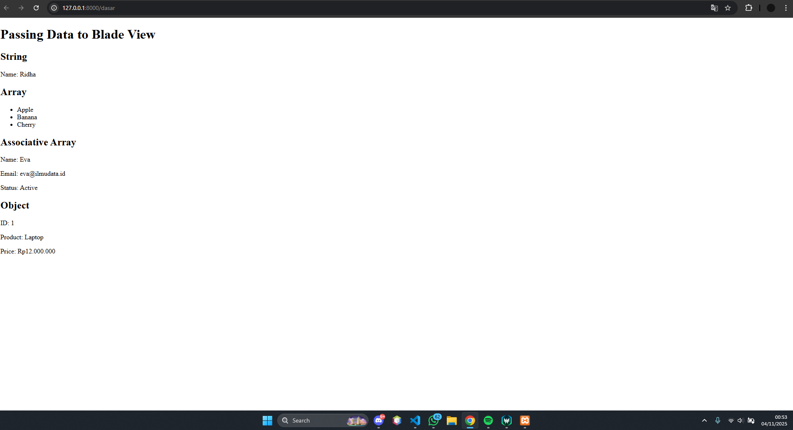
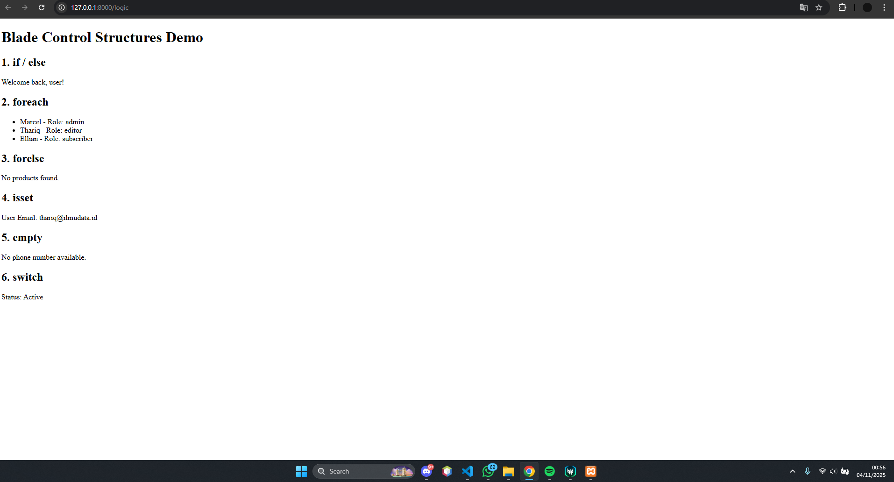
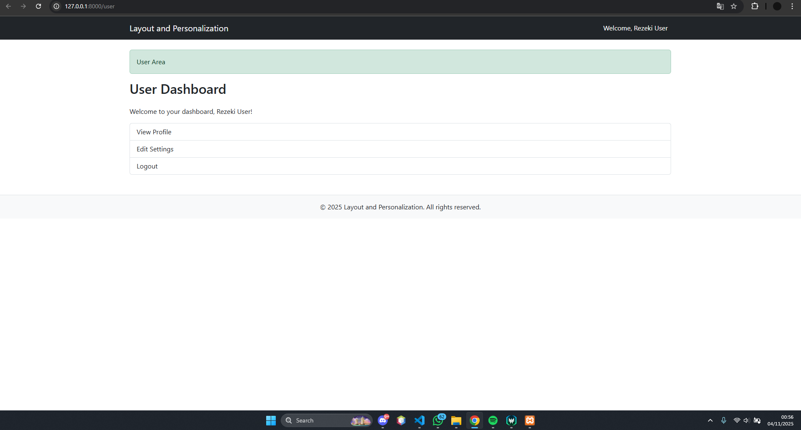
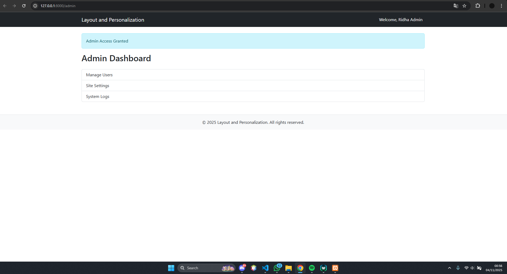
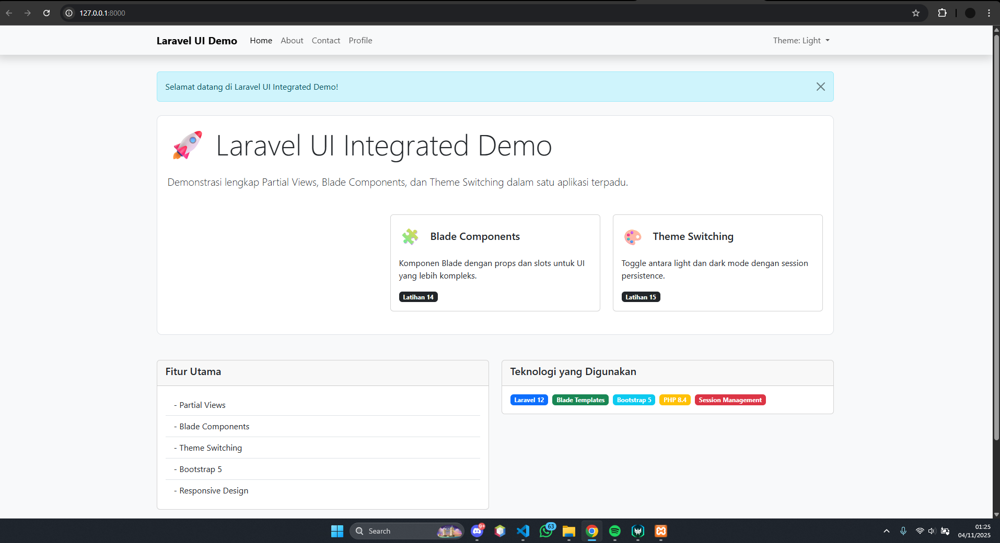
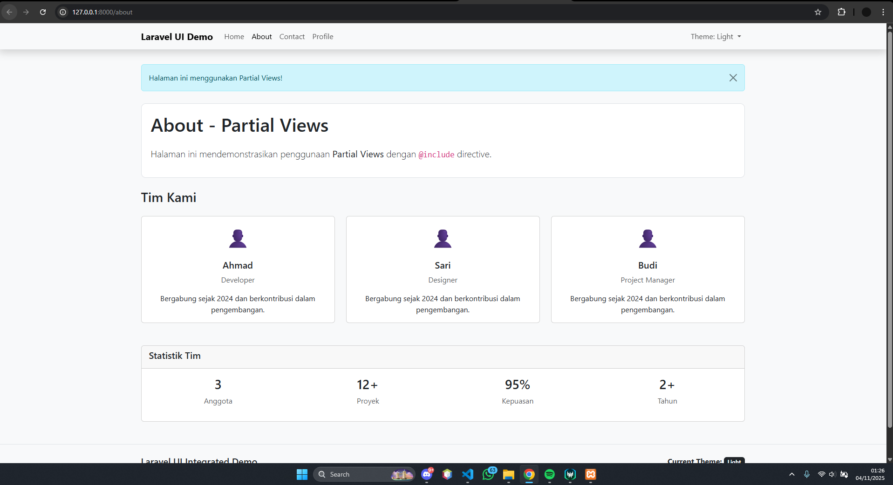
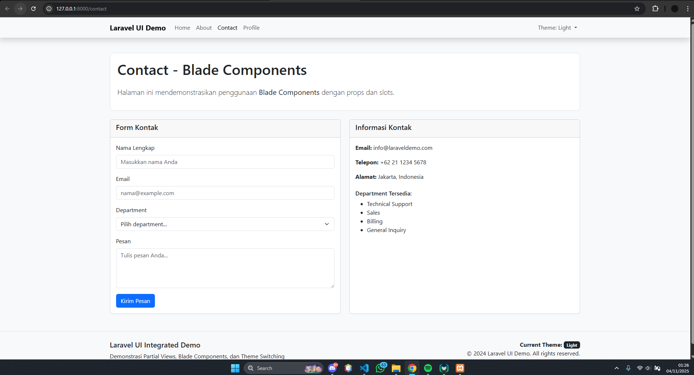
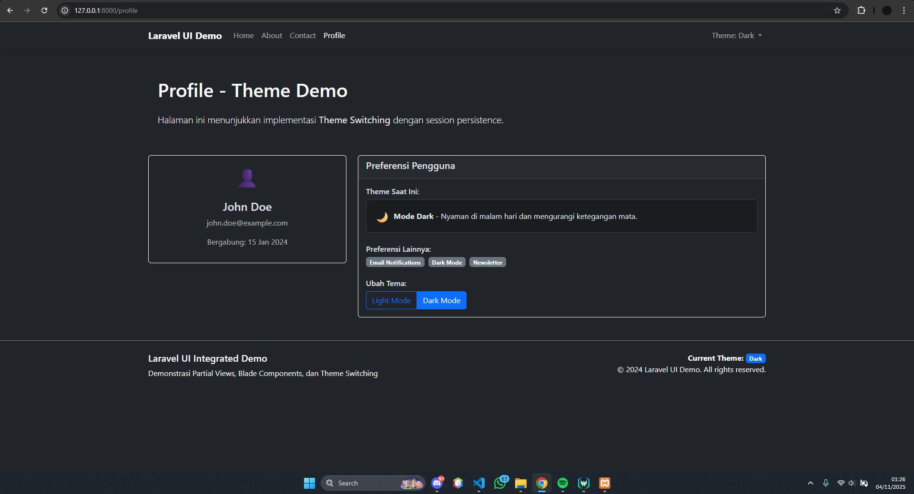

# Laporan Praktikum Modul 4 – Blade Template, Partial Views, Blade Components, dan Theme Switching di Laravel 12

**Mata Kuliah:** Workshop Web Lanjut  

**Nama:** Muhammad Ridha Rezeki

**NIM:** 2024573010096

**Kelas:** TI 2B  
 

---

## Abstrak**

Modul ini membahas cara memanfaatkan **Laravel Blade Template Engine** untuk menyusun tampilan aplikasi web yang rapi, dapat digunakan ulang, dan mudah dipelihara. Fokus utama praktikum adalah: 

1. mengirim berbagai jenis data dari controller ke view, 
2. menggunakan struktur kontrol Blade untuk menampilkan konten dinamis,
3. membuat layout berbasis Blade + Bootstrap yang bisa dipakai lintas halaman, dan 
4. menggabungkan partial views, Blade components, serta theme switching (mode terang/gelap) dalam satu aplikasi kecil. 


---

## BAB I – Dasar Teori**

### 1.1 Blade Template Engine**

Blade adalah *template engine* bawaan Laravel yang menyederhanakan pembuatan tampilan melalui sintaks yang lebih ringkas seperti `@if`, `@foreach`, `@include`, dan `@yield`. Blade juga mendukung pewarisan layout serta komponen yang dapat digunakan ulang (*reusable components*).

Keunggulan utama Blade:
- Memisahkan logika dan tampilan (*separation of concerns*).  
- Memungkinkan penggunaan layout utama dan partial.  
- Mendukung *theme switching* menggunakan session atau localStorage.  
- Mempercepat pengembangan UI berbasis Bootstrap atau Tailwind.

---

## BAB II – Praktikum dan Pembahasan**

### Praktikum 1 – Meneruskan Data dari Controller ke Blade View**

**Tujuan:**  
Menampilkan berbagai jenis data (string, array, associative array, dan object) yang dikirim dari controller ke Blade view.

**Langkah-Langkah:**

1. **Membuat Project Baru**
   ```bash
   laravel new modul-4-blade-view
   cd modul-4-blade-view
   code .
   ```

2. **Membuat Controller**
   ```bash
   php artisan make:controller DasarBladeController
   ```

3. **Menambahkan Route**
   ```php
   use App\Http\Controllers\DasarBladeController;
   Route::get('/dasar', [DasarBladeController::class, 'showData']);
   ```

4. **Mendefinisikan Method Controller**
   ```php
    public function showData()

    $name = 'Ridha';
    $fruits = ['Apple', 'Banana', 'Cherry'];
    $user = [
        'name' => 'Eva',
        'email' => 'eva@ilmudata.id',
        'is_active' => true,
    ];
    $product = (object) [
        'id' => 1,
        'name' => 'Laptop',
        'price' => 12000000
    ];

   ```

5. **Membuat View**
   ```blade
   <!-- resources/views/dasar.blade.php -->
    <h1>Passing Data to Blade View</h1>
    
    <h2>String</h2>
    <p>Name: {{ $name }}</p>
    
    <h2>Array</h2>
    <ul>
        @foreach ($fruits as $fruit)
            <li>{{ $fruit }}</li>
        @endforeach
    </ul>
    
    <h2>Associative Array</h2>
    <p>Name: {{ $user['name'] }}</p>
    <p>Email: {{ $user['email'] }}</p>
    <p>Status: {{ $user['is_active'] ? 'Active' : 'Inactive' }}</p>
    
    <h2>Object</h2>
    <p>ID: {{ $product->id }}</p>
    <p>Product: {{ $product->name }}</p>
    <p>Price: Rp{{ number_format($product->price, 0, ',', '.') }}</p>
   ```

6. **Menjalankan Aplikasi**
   ```bash
   php artisan serve
   ```


**Hasil:**   
Halaman Dasar
Buka: http://127.0.0.1:8000/dasar




---

### Praktikum 2 – Menggunakan Struktur Kontrol Blade**

**Tujuan:**  
Mengimplementasikan struktur kontrol seperti `@if`, `@foreach`, `@isset`, dan `@switch` di Blade view.

**Langkah-Langkah:**

1. **Membuat Controller**
   ```bash
   php artisan make:controller LogicController
   ```

2. **Menambahkan Route**
   ```php
   use App\Http\Controllers\LogicController;
   Route::get('/logic', [LogicController::class, 'show']);
   ```

3. **Menambahkan Logika pada Controller**
   ```php
   public function show()
   {
    $isLoggedIn = true;
    $users = [
        ['name' => 'Marcel', 'role' => 'admin'],
        ['name' => 'Thariq', 'role' => 'editor'],
        ['name' => 'Ellian', 'role' => 'subscriber'],
    ];
    $products = []; // Simulasi array kosong untuk @forelse
    $profile = [
        'name' => 'Thariq',
        'email' => 'thariq@ilmudata.id'
    ];
    $status = 'active';
    
    return view('logic', compact('isLoggedIn', 'users', 'products', 'profile', 'status'));
   }
   ```

4. **Membuat View**
   ```blade
   <!-- resources/views/logic.blade.php -->
   <h1>Demo Struktur Kontrol Blade</h1>

   @if ($isLoggedIn)
       <p>Selamat datang kembali!</p>
   @else
       <p>Silakan login.</p>
   @endif

   <h3>Daftar Pengguna:</h3>
   <ul>
       @foreach ($users as $user)
           <li>{{ $user['name'] }} – {{ $user['role'] }}</li>
       @endforeach
   </ul>

   @forelse ($products as $product)
       <p>{{ $product }}</p>
   @empty
       <p>Belum ada produk tersedia.</p>
   @endforelse

   @isset($profile['email'])
       <p>Email: {{ $profile['email'] }}</p>
   @endisset

   @switch($status)
       @case('active')
           <p>Status: Aktif</p>
           @break
       @default
           <p>Status tidak diketahui</p>
   @endswitch
   ```

**Hasil:**  
Halaman Dasar
Buka: http://127.0.0.1:8000/logic




---

### Praktikum 3 – Layout dan Personalisasi dengan Bootstrap**

**Tujuan:**  
Membuat tampilan dengan layout utama dan dua halaman berbeda (admin dan user).

**Langkah-Langkah:**
1. **Buat Controller:**
   ```bash
   php artisan make:controller PageController
   ```
2. **Tambah Route:**
   ```php
   Route::get('/admin', [PageController::class, 'admin']);
   Route::get('/user', [PageController::class, 'user']);
   ```
3. **Buat Layout dan View:**
   ```blade
   <!-- resources/views/layouts/app.blade.php -->
    <nav class="navbar navbar-expand-lg navbar-dark bg-dark mb-4">
        <div class="container">
            <a class="navbar-brand" href="#">Layout and Personalization</a>
            <div class="collapse navbar-collapse">
                <ul class="navbar-nav ms-auto">
                    <li class="nav-item">
                        <span class="nav-link active">Welcome, {{ $username }}</span>
                    </li>
                </ul>
            </div>
        </div>
    </nav>

    <div class="container">
        @if ($role === 'admin')
            <div class="alert alert-info">Admin Access Granted</div>
        @elseif ($role === 'user')
            <div class="alert alert-success">User Area</div>
        @endif

        @yield('content')
    </div>

    <footer class="bg-light text-center mt-5 p-3 border-top">
        <p class="mb-0">&copy; 2025 Layout and Personalization. All rights reserved.</p>
    </footer>

    <script src="https://cdn.jsdelivr.net/npm/bootstrap@5.3.0/dist/js/bootstrap.bundle.min.js"></script>
   ```
   ```blade
   <!-- resources/views/admin/dashboard.blade.php -->
   @extends('layouts.app')

   @section('title', 'Admin Dashboard')

   @section('content')
      <h2 class="mb-4">Admin Dashboard</h2>
      <div class="list-group">
         <a href="#" class="list-group-item list-group-item-action">Manage Users</a>
         <a href="#" class="list-group-item list-group-item-action">Site Settings</a>
         <a href="#" class="list-group-item list-group-item-action">System Logs</a>
      </div>
   @endsection
   ```

   ```blade
   <!-- resources/views/user/dashboard.blade.php -->
   @extends('layouts.app')

   @section('title', 'User Dashboard')

   @section('content')
      <h2 class="mb-4">User Dashboard</h2>
      <p>Welcome to your dashboard, {{ $username }}!</p>
      <div class="list-group">
         <a href="#" class="list-group-item list-group-item-action">View Profile</a>
         <a href="#" class="list-group-item list-group-item-action">Edit Settings</a>
         <a href="#" class="list-group-item list-group-item-action">Logout</a>
      </div>
   @endsection
   ```

**Hasil:**  
Buka Halaman User:http://127.0.0.1:8000/user


Buka Halaman Admin:http://127.0.0.1:8000/admin



---

### Praktikum 4 — Partial Views, Blade Components, dan Theme Switching (Laravel 12)**

**Tujuan**  
Menggabungkan tiga konsep UI Laravel: *partial views* (untuk potongan tampilan berulang), *Blade components* (UI reusable dengan props/slot), dan *theme switching* (Light/Dark) berbasis session agar tampilan bisa dipersonalisasi.


#### Langkah 1 — Buat Proyek Laravel**
```bash
laravel new modul-4-laravel-ui
cd modul-4-laravel-ui
code .
```


#### Langkah 2 — Buat Controller**
Buat satu controller untuk menangani seluruh halaman:
```bash
php artisan make:controller UIController
```


#### Langkah 3 — Definisikan Routes**
Tambahkan route pada `routes/web.php`:
```php
use App\Http\Controllers\UIController;

Route::get('/', [UIController::class, 'home'])->name('home');
Route::get('/about', [UIController::class, 'about'])->name('about');
Route::get('/contact', [UIController::class, 'contact'])->name('contact');
Route::get('/profile', [UIController::class, 'profile'])->name('profile');
Route::get('/switch-theme/{theme}', [UIController::class, 'switchTheme'])->name('switch-theme');
```


#### Langkah 4 — Isi Controller**
`app/Http/Controllers/UIController.php`:
```php
<?php

namespace App\Http\Controllers;

use Illuminate\Http\Request;

class UIController extends Controller
{
    public function home(Request $request)
    {
        $theme = session('theme', 'light');
        $alertMessage = 'Selamat datang di Laravel UI Integrated Demo!';
        $features = ['Partial Views','Blade Components','Theme Switching','Bootstrap 5','Responsive Design'];
        return view('home', compact('theme','alertMessage','features'));
    }

    public function about(Request $request)
    {
        $theme = session('theme', 'light');
        $alertMessage = 'Halaman ini menggunakan Partial Views!';
        $team = [
            ['name' => 'Ahmad', 'role' => 'Developer'],
            ['name' => 'Sari', 'role' => 'Designer'],
            ['name' => 'Budi', 'role' => 'Project Manager']
        ];
        return view('about', compact('theme','alertMessage','team'));
    }

    public function contact(Request $request)
    {
        $theme = session('theme', 'light');
        $departments = ['Technical Support','Sales','Billing','General Inquiry'];
        return view('contact', compact('theme','departments'));
    }

    public function profile(Request $request)
    {
        $theme = session('theme', 'light');
        $user = [
            'name' => 'John Doe',
            'email' => 'john.doe@example.com',
            'join_date' => '2024-01-15',
            'preferences' => ['Email Notifications','Dark Mode','Newsletter']
        ];
        return view('profile', compact('theme','user'));
    }

    public function switchTheme($theme, Request $request)
    {
        if (in_array($theme, ['light','dark'])) {
            session(['theme' => $theme]);
        }
        return back();
    }
}
```


#### Langkah 5 — Layout Utama (Theme Support)**
Buat `resources/views/layouts/app.blade.php`:
```blade
<!DOCTYPE html>
<html lang="id" data-bs-theme="{{ $theme }}">
<head>
  <meta charset="UTF-8" />
  <meta name="viewport" content="width=device-width, initial-scale=1.0" />
  <title>@yield('title','Laravel UI Integrated Demo')</title>
  <link href="https://cdn.jsdelivr.net/npm/bootstrap@5.3.3/dist/css/bootstrap.min.css" rel="stylesheet" />
  <style>
    body { padding-top:4rem; transition:.3s; min-height:100vh; }
    .theme-demo { border-radius:10px; padding:20px; margin:10px 0; transition:.3s; }
    .feature-card { transition:transform .2s; }
    .feature-card:hover { transform:translateY(-5px); }
  </style>
</head>
<body class="{{ $theme === 'dark' ? 'bg-dark text-light' : 'bg-light text-dark' }}">
  @include('partials.navigation')

  <div class="container mt-4">
    @if(isset($alertMessage) && !empty($alertMessage))
      @include('partials.alert', ['message' => $alertMessage, 'type' => 'info'])
    @endif

    @yield('content')
  </div>

  <x-footer :theme="$theme" />

  <script src="https://cdn.jsdelivr.net/npm/bootstrap@5.3.3/dist/js/bootstrap.bundle.min.js"></script>
  <script>
    document.addEventListener('DOMContentLoaded', function() {
      const themeLinks = document.querySelectorAll('a[href*="switch-theme"]');
      themeLinks.forEach(link => link.addEventListener('click', e => {
        e.preventDefault(); window.location.href = link.href;
      }));
    });
  </script>
</body>
</html>
```


#### Langkah 6 — Partial Views**
`resources/views/partials/navigation.blade.php`:
```blade
<nav class="navbar navbar-expand-lg {{ $theme === 'dark' ? 'navbar-dark bg-dark' : 'navbar-light bg-light' }} fixed-top shadow">
  <div class="container">
    <a class="navbar-brand fw-bold" href="{{ route('home') }}">Laravel UI Demo</a>

    <button class="navbar-toggler" type="button" data-bs-toggle="collapse" data-bs-target="#navbarNav">
      <span class="navbar-toggler-icon"></span>
    </button>

    <div class="collapse navbar-collapse" id="navbarNav">
      <ul class="navbar-nav me-auto">
        <li class="nav-item"><a class="nav-link {{ request()->routeIs('home') ? 'active' : '' }}" href="{{ route('home') }}">Home</a></li>
        <li class="nav-item"><a class="nav-link {{ request()->routeIs('about') ? 'active' : '' }}" href="{{ route('about') }}">About</a></li>
        <li class="nav-item"><a class="nav-link {{ request()->routeIs('contact') ? 'active' : '' }}" href="{{ route('contact') }}">Contact</a></li>
        <li class="nav-item"><a class="nav-link {{ request()->routeIs('profile') ? 'active' : '' }}" href="{{ route('profile') }}">Profile</a></li>
      </ul>

      <ul class="navbar-nav">
        <li class="nav-item dropdown">
          <a class="nav-link dropdown-toggle" href="#" role="button" data-bs-toggle="dropdown">
            Theme: {{ ucfirst($theme) }}
          </a>
          <ul class="dropdown-menu dropdown-menu-end">
            <li><a class="dropdown-item" href="{{ route('switch-theme','light') }}">Light Mode</a></li>
            <li><a class="dropdown-item" href="{{ route('switch-theme','dark') }}">Dark Mode</a></li>
          </ul>
        </li>
      </ul>
    </div>
  </div>
</nav>
```

`resources/views/partials/alert.blade.php`:
```blade
@if(!empty($message))
<div class="alert alert-{{ $type ?? 'info' }} alert-dismissible fade show" role="alert">
  {{ $message }}
  <button type="button" class="btn-close" data-bs-dismiss="alert"></button>
</div>
@endif
```


#### Langkah 7 — Blade Components**
Buat komponen:
```bash
php artisan make:component Footer
php artisan make:component FeatureCard
php artisan make:component TeamMember
php artisan make:component ContactForm
```

`resources/views/components/footer.blade.php`:
```blade
<footer class="mt-5 py-4 border-top {{ $theme === 'dark' ? 'border-secondary' : '' }}">
  <div class="container">
    <div class="row">
      <div class="col-md-6">
        <h5>Laravel UI Integrated Demo</h5>
        <p class="mb-0">Demonstrasi Partial Views, Blade Components, dan Theme Switching</p>
      </div>
      <div class="col-md-6 text-md-end">
        <p class="mb-0"><strong>Current Theme:</strong>
          <span class="badge {{ $theme === 'dark' ? 'bg-primary' : 'bg-dark' }}">{{ ucfirst($theme) }}</span>
        </p>
        <p class="mb-0">&copy; 2024 Laravel UI Demo. All rights reserved.</p>
      </div>
    </div>
  </div>
</footer>
```

`resources/views/components/feature-card.blade.php`:
```blade
<div class="card feature-card h-100 {{ $theme === 'dark' ? 'bg-secondary text-white' : '' }}">
  <div class="card-body">
    <div class="d-flex align-items-center mb-3">
      <span class="fs-2 me-3">{{ $icon ?? '⭐' }}</span>
      <h5 class="card-title mb-0">{{ $title }}</h5>
    </div>
    <p class="card-text">{{ $description }}</p>
    @if(isset($badge))
      <span class="badge {{ $theme === 'dark' ? 'bg-light text-dark' : 'bg-dark' }}">{{ $badge }}</span>
    @endif
  </div>
</div>
```

`resources/views/components/team-member.blade.php`:
```blade
<div class="col-md-4 mb-4">
  <div class="card {{ $theme === 'dark' ? 'bg-dark border-light' : '' }} h-100">
    <div class="card-body text-center">
      <div class="mb-3"><span class="fs-1">{{ $avatar ?? '👤' }}</span></div>
      <h5 class="card-title">{{ $name }}</h5>
      <p class="card-text text-muted">{{ $role }}</p>
      <p class="card-text">{{ $description }}</p>
    </div>
  </div>
</div>
```

`resources/views/components/contact-form.blade.php`:
```blade
<div class="card {{ $theme === 'dark' ? 'bg-dark border-light' : '' }} h-100">
  <div class="card-header"><h5>Form Kontak</h5></div>
  <div class="card-body">
    <form>
      <div class="mb-3">
        <label class="form-label">Nama Lengkap</label>
        <input type="text" class="form-control {{ $theme === 'dark' ? 'bg-dark text-light border-light' : '' }}" placeholder="Masukkan nama Anda">
      </div>
      <div class="mb-3">
        <label class="form-label">Email</label>
        <input type="email" class="form-control {{ $theme === 'dark' ? 'bg-dark text-light border-light' : '' }}" placeholder="nama@example.com">
      </div>
      <div class="mb-3">
        <label class="form-label">Department</label>
        <select class="form-select {{ $theme === 'dark' ? 'bg-dark text-light border-light' : '' }}">
          <option selected>Pilih department...</option>
          @foreach($departments as $dept)
            <option value="{{ $dept }}">{{ $dept }}</option>
          @endforeach
        </select>
      </div>
      <div class="mb-3">
        <label class="form-label">Pesan</label>
        <textarea class="form-control {{ $theme === 'dark' ? 'bg-dark text-light border-light' : '' }}" rows="4" placeholder="Tulis pesan Anda..."></textarea>
      </div>
      <button type="submit" class="btn btn-primary">Kirim Pesan</button>
    </form>
  </div>
</div>
```

#### Langkah 8 — Main Views**
`resources/views/home.blade.php`:
```blade
@extends('layouts.app')
@section('title','Home - Integrated Demo')

@section('content')
<div class="row">
  <div class="col-12">
    <div class="theme-demo {{ $theme === 'dark' ? 'bg-dark border-light' : 'bg-white border' }} mb-5">
      <h1 class="display-4 mb-4">🚀 Laravel UI Integrated Demo</h1>
      <p class="lead">Demonstrasi lengkap Partial Views, Blade Components, dan Theme Switching.</p>
      <div class="row mt-5">
        <div class="col-md-4 mb-4">
          <x-feature-card title="Partial Views" icon="📁" description="Gunakan @include untuk komponen sederhana." badge="Latihan 13" />
        </div>
        <div class="col-md-4 mb-4">
          <x-feature-card title="Blade Components" icon="🧩" description="Komponen dengan props & slots." badge="Latihan 14" />
        </div>
        <div class="col-md-4 mb-4">
          <x-feature-card title="Theme Switching" icon="🎨" description="Light/Dark mode via session." badge="Latihan 15" />
        </div>
      </div>
    </div>
  </div>
</div>
@endsection
```

`resources/views/about.blade.php`:
```blade
@extends('layouts.app')
@section('title','About - Partial Views Demo')

@section('content')
<div class="row">
  <div class="col-12">
    <div class="theme-demo {{ $theme === 'dark' ? 'bg-dark border-light' : 'bg-white border' }} mb-4">
      <h1 class="mb-4">About - Partial Views</h1>
      <p class="lead">Menggunakan <code>@include</code> untuk potongan UI berulang.</p>
    </div>

    <h3 class="mb-4">Tim Kami</h3>
    <div class="row">
      @foreach($team as $member)
        <x-team-member
          :name="$member['name']"
          :role="$member['role']"
          :theme="$theme"
          :avatar="['👨‍💻','👩‍🎨','👨‍💼'][$loop->index]"
          :description="'Bergabung sejak 2024 dan aktif berkontribusi.'"
        />
      @endforeach
    </div>

    @include('partials.team-stats', ['theme' => $theme])
  </div>
</div>
@endsection
```

`resources/views/partials/team-stats.blade.php`:
```blade
<div class="card {{ $theme === 'dark' ? 'bg-dark border-light' : '' }} mt-4">
  <div class="card-header"><h5>Statistik Tim</h5></div>
  <div class="card-body">
    <div class="row text-center">
      <div class="col-md-3"><h3>3</h3><p class="text-muted">Anggota</p></div>
      <div class="col-md-3"><h3>12+</h3><p class="text-muted">Proyek</p></div>
      <div class="col-md-3"><h3>95%</h3><p class="text-muted">Kepuasan</p></div>
      <div class="col-md-3"><h3>2+</h3><p class="text-muted">Tahun</p></div>
    </div>
  </div>
</div>
```

`resources/views/contact.blade.php`:
```blade
@extends('layouts.app')
@section('title','Contact - Components Demo')

@section('content')
<div class="row">
  <div class="col-12">
    <div class="theme-demo {{ $theme === 'dark' ? 'bg-dark border-light' : 'bg-white border' }} mb-4">
      <h1 class="mb-4">Contact - Blade Components</h1>
      <p class="lead">Form kontak sebagai komponen Blade (props & pengisian dinamis).</p>
    </div>

    <div class="row">
      <div class="col-md-6">
        <x-contact-form :theme="$theme" :departments="$departments" />
      </div>
      <div class="col-md-6">
        <div class="card {{ $theme === 'dark' ? 'bg-dark border-light' : '' }} h-100">
          <div class="card-header"><h5>Informasi Kontak</h5></div>
          <div class="card-body">
            <p><strong>Email:</strong> info@laraveldemo.com</p>
            <p><strong>Telepon:</strong> +62 21 1234 5678</p>
            <p><strong>Alamat:</strong> Jakarta, Indonesia</p>
            <h6 class="mt-4">Department Tersedia:</h6>
            <ul>
              @foreach($departments as $dept)
                <li>{{ $dept }}</li>
              @endforeach
            </ul>
          </div>
        </div>
      </div>
    </div>

  </div>
</div>
@endsection
```

`resources/views/profile.blade.php`:
```blade
@extends('layouts.app')
@section('title','Profile - Theme Demo')

@section('content')
<div class="row">
  <div class="col-12">
    <div class="theme-demo {{ $theme === 'dark' ? 'bg-dark border-light' : 'bg-white border' }} mb-4">
      <h1 class="mb-4">Profile - Theme Demo</h1>
      <p class="lead">Contoh *theme switching* dengan penyimpanan preferensi di session.</p>
    </div>

    <div class="row">
      <div class="col-md-4">
        <div class="card {{ $theme === 'dark' ? 'bg-dark border-light' : '' }} text-center">
          <div class="card-body">
            <div class="mb-3"><span class="fs-1">👤</span></div>
            <h4>{{ $user['name'] }}</h4>
            <p class="text-muted">{{ $user['email'] }}</p>
            <p class="text-muted">Bergabung: {{ date('d M Y', strtotime($user['join_date'])) }}</p>
          </div>
        </div>
      </div>

      <div class="col-md-8">
        <div class="card {{ $theme === 'dark' ? 'bg-dark border-light' : '' }}">
          <div class="card-header"><h5>Preferensi Pengguna</h5></div>
          <div class="card-body">
            <h6>Theme Saat Ini:</h6>
            <div class="alert alert-{{ $theme === 'dark' ? 'dark' : 'info' }} d-flex align-items-center">
              <span class="me-2 fs-4">{{ $theme === 'dark' ? '🌙' : '☀️' }}</span>
              <div>
                <strong>Mode {{ ucfirst($theme) }}</strong> — 
                @if($theme === 'dark') Nyaman di malam hari. @else Cerah untuk siang hari. @endif
              </div>
            </div>

            <h6 class="mt-4">Preferensi Lainnya:</h6>
            <div class="d-flex flex-wrap gap-2">
              @foreach($user['preferences'] as $pref)
                <span class="badge bg-secondary">{{ $pref }}</span>
              @endforeach
            </div>

            <div class="mt-4">
              <h6>Ubah Tema:</h6>
              <div class="btn-group" role="group">
                <a href="{{ route('switch-theme','light') }}" class="btn btn-{{ $theme === 'light' ? 'primary' : 'outline-primary' }}">Light Mode</a>
                <a href="{{ route('switch-theme','dark') }}" class="btn btn-{{ $theme === 'dark' ? 'primary' : 'outline-primary' }}">Dark Mode</a>
              </div>
            </div>
          </div>
        </div>
      </div>

    </div>
  </div>
</div>
@endsection
```


**Hasil:**  
Home: http://127.0.0.1:8000


About: http://127.0.0.1:8000/about


Contact: http://127.0.0.1:8000/contact


Profile: http://127.0.0.1:8000/profile



---

## BAB III – Kesimpulan**

1. Blade Template Engine mempermudah pembuatan tampilan dinamis dengan struktur yang terorganisir.  
2. Struktur kontrol Blade membantu menulis logika dengan sintaks yang lebih bersih.  
3. Layout dan partial views mempercepat pengembangan halaman baru.  
4. Blade components dan theme switching meningkatkan modularitas serta interaktivitas UI.  
5. Seluruh konsep pada praktikum ini memperkuat pemahaman mahasiswa terhadap arsitektur MVC di Laravel.

---

## Daftar Pustaka**

- Laravel Official Documentation – [Blade Templates](https://laravel.com/docs/12.x/blade)  
- Modul Praktikum Workshop Web Lanjut (Modul 4 – Laravel Blade Template)  
https://hackmd.io/@mohdrzu/r1AIUzWpll#Praktikum-4---Partial-Views-Blade-Components-dan-Theme-Switching-di-Laravel-12
 
